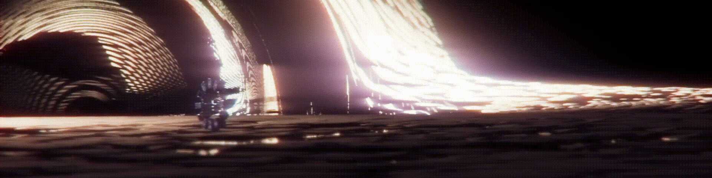

<h1 align="center">🌌 Gravi</h1>

  
  
  
  

---

**Gravi** is an open-source **non-linear raytracing engine** built in **C++**, leveraging **Qt** and Pixar’s **Universal Scene Description (USD)**.  

📖 Read the [**Documentation & Guide**](https://cjhosken.github.io/blog/gravi/) for more details.  
⬇️ Download [**Gravi v1.0.0**](https://github.com/cjhosken/Gravi/releases/tag/v1.0.0) and try it out yourself!

---

## ✨ Features

- 🚀 **C++ Qt Application** — Combines Qt with a USD viewport inside a native C++ application.  
- 🧩 **Custom USD Schemas** — Includes purpose-built USD schemas for advanced rendering.  
- 🎥 **USD Hydra Render Delegate** — `hdGravi` can be loaded into any DCC (Digital Content Creation tool) for rendering.  

---

## 🎬 Examples

  <h3>🍳 Kitchen Set</h3>
  
Gravity well simulation inside the USD kitchen scene.

  <a href="https://github.com/user-attachments/assets/f8b9bf07-0ea1-4f0e-9d16-bb68e565d046">▶️ Watch Example</a>

  <h3>🌌 Interstellar</h3>
  
A re-creation attempt of a shot from <i>Interstellar (2014)</i>.

  <a href="https://github.com/user-attachments/assets/eb25930b-0167-466f-8d57-9037a90ac457">▶️ Watch Example</a>

---

## 📽 Demo Video

Experience **Gravi** in action:  

👉 [Watch Demo Video](https://github.com/user-attachments/assets/12013a84-0334-4b61-a554-2fad2d615dff)  

📦 Get the latest version from the [**Release Page**](https://github.com/cjhosken/gravi/releases).

---

## 📬 Contact & Information

Gravi was created by **Christopher Hosken** for the  
*Computing for Graphics and Animation* course at **Bournemouth University**.  

- 📧 Email: [hoskenchristopher@gmail.com](mailto:hoskenchristopher@gmail.com)  
- 🔗 LinkedIn: [christopher-hosken](https://www.linkedin.com/in/christopher-hosken/)  

---
